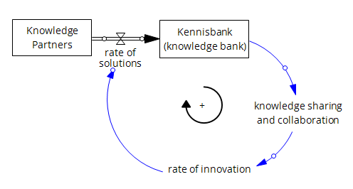

# Kennisbank

A place to share system dynamics models for infrastructure innovation in the Netherlands.

Our partners solve infrastructure problems, sometimes system dynamic models: improve our understnading the problems, identify what drives the system to change (dynamics), and formulate effective solutions.
These partners deposit some of these models in our Kennisbank (knowledge bank) to facilitate collaboration and sharing. 
Sharing knowledge about our systems and solutions to dynamic problems drives innovation, leading to more durable, creative and effective solutions. In short...

## How to Join the Kennisbank Network
Our knowledge is open where possible. Whether you are Rijkswaterstaat, a contributing party, or an interested member of the public, you are able to join our network at an appropriate accessibility level. You can join in different ways, depending on what you'd like to do:   
If youd like to view and download publicly avialable data/models you do not need a Github account.  

## How to Navigate the Kennisbank
1. Find your project under 'Repositories' 
2. In your project's repository, the main (readme) page contains further instructions. Typically, models, data and other project information are stored in separate folders. Depending on restrictions, you can view, download or contribute to these folders and its contents 
3. Other repositories contain additional information. Feel free to click through them to learn more!

**Good Luck!**
